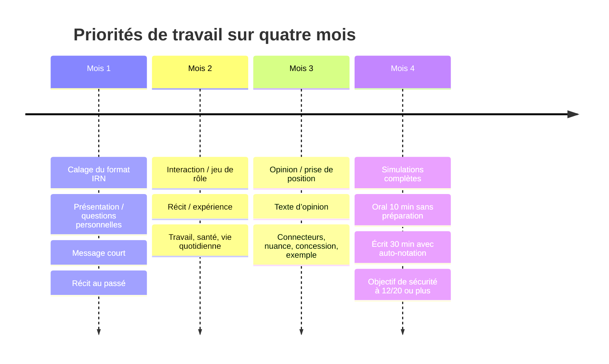

# Banque de questions TCF IRN B2 pour l’expression orale et l’expression écrite

## Synthèse exécutive

Le cadre le plus fiable pour construire une banque réaliste vient des spécifications publiées par entity["organization","France Éducation international","sevres, ile-de-france, fr"]. Depuis le 12 mai 2025, le TCF IRN permet d’être évalué jusqu’au niveau B2, ce qui est directement aligné avec l’exigence annoncée pour la naturalisation au plus tard au 1er janvier 2026. Le format pertinent pour votre objectif est donc bien un entraînement IRN centré sur le B2, et non un entraînement “long essai / long exposé” calqué sur d’autres déclinaisons du TCF. citeturn16view0turn20search5

Pour les deux productions qui vous intéressent, le cadre officiel est très net : expression orale en face à face, 10 minutes, 3 tâches, sans préparation ; expression écrite, 30 minutes, 3 tâches, avec des longueurs attendues de 30 à 60 mots, puis 40 à 90 mots, puis 40 à 90 mots. À l’oral, la logique est progressive : entretien dirigé, interaction, puis point de vue ; à l’écrit, la logique est descriptive puis narrative puis argumentative, mais toujours en format court. citeturn14view0turn12view0turn3view1turn0search2

La banque ci-dessous est donc **originale**, mais **strictement contrainte** par : les consignes officielles IRN, les exemples publics fournis aux candidats, les critères officiels d’évaluation du TCF, les descripteurs publics B2 utilisés pour le DELF B2 par la même institution, et des familles de sujets récurrentes dans les supports de préparation francophones. Les exemples publics officiels ne montrent qu’un nombre limité de sujets illustratifs ; pour l’oral, le document examinateur précise même que les versions réelles comportent 5 sujets pour la tâche 2 et 5 sujets pour la tâche 3, l’examinateur n’en choisissant qu’un à chaque fois. J’interprète ici `task_number` comme **l’identifiant de la famille de tâche** de 1 à 6, commun à toutes les lignes d’un même `task_type`. citeturn1search1turn9view0turn24view1turn24view2turn17view0

## Format officiel et logique d’évaluation

Pour bâtir une banque exploitable jour après jour, il faut distinguer ce qui est **officiel** et ce qui relève de la **meilleure approximation de travail**. Officiellement, l’oral IRN dure 10 minutes avec 3 tâches sans préparation ; l’écrit dure 30 minutes avec 3 tâches brèves ; les productions orales et écrites sont chacune corrigées deux fois de manière indépendante ; et les attestations comportent une note sur 20 pour l’oral et une note sur 20 pour l’écrit. citeturn14view0turn10view0turn19view1

| Épreuve | Tâche | Cadre officiel | Vérification utile en entraînement |
|---|---|---|---|
| Oral | Présentation / questions personnelles | 3 min, sans préparation | tenir 3 min avec relances, sans récitation mécanique |
| Oral | Interaction / jeu de rôle | 3 min 30, sans préparation | expliquer besoins + poser des questions utiles + réagir |
| Oral | Opinion / prise de position | 3 min 30, sans préparation | introduire, donner 2 arguments, nuancer, conclure |
| Écrit | Message court | 30–60 mots | répondre exactement à la demande, décrire nettement |
| Écrit | Récit / expérience | 40–90 mots | raconter au passé avec ordre clair et détails concrets |
| Écrit | Texte d’opinion | 40–90 mots | prendre position + justifier + illustrer brièvement |

Sur la logique de notation, les documents candidats du TCF disent deux choses essentielles. D’abord, chaque évaluateur attribue un niveau CECRL à chacune des trois tâches de production ; ensuite, une **règle de calcul** transforme l’ensemble en note finale et en niveau final, mais cette règle n’est pas détaillée publiquement dans les documents candidats. Les critères officiels TCF sont groupés en trois familles : linguistique, pragmatique et sociolinguistique. Pour s’auto-évaluer de manière opérationnelle, la meilleure approximation publique reste donc : critères TCF officiels + grilles et descripteurs publics du DELF B2. citeturn13view0turn10view0turn10view2turn11view0turn11view1

| Dimension à contrôler | Oral B2 repérable | Écrit B2 repérable |
|---|---|---|
| Réalisation de la tâche | répond pleinement à la consigne, apporte détails utiles, reste dans la situation | répond à tout ce qui est demandé, sans hors-sujet ni oubli |
| Cohérence / structuration | enchaîne clairement les idées avec des connecteurs | produit un texte suivi, lisible, bien articulé |
| Adéquation sociolinguistique | ton adapté à l’examinateur et à la situation | registre adapté au destinataire, au forum, au message |
| Lexique | vocabulaire assez large, répétitions limitées, périphrases possibles | lexique varié et globalement précis, orthographe non bloquante |
| Morphosyntaxe | structures fréquentes bien contrôlées, erreurs non bloquantes | contrôle grammatical globalement bon, erreurs non bloquantes |
| Phonologie | prononciation intelligible, accent non gênant | non applicable |

Pour une cible chiffrée, la grille publique d’interprétation des notes TCF associe **B2 à 10–13/20** pour l’expression, **C1 à 14–17/20** et **C2 à 18–20/20**. Comme la combinaison exacte des trois tâches n’est pas publiée, la stratégie la plus prudente pour votre préparation est simple : **visez au moins 12/20 sur vos simulations orales et écrites**, avec **aucune tâche clairement en dessous du B2**. citeturn23view0turn13view0

## Calendrier de préparation sur quatre mois

La progression la plus rentable, pour un profil B1 visant B2 sur l’IRN, consiste à verrouiller d’abord le **format court**, puis l’**interaction**, puis l’**argumentation**, et enfin les **simulations intégrales**. Cette séquence est cohérente avec la structure officielle des tâches, l’absence de préparation à l’oral, et les descripteurs publics B2 qui insistent sur la clarté, les connecteurs, les explications, les arguments et les exemples plutôt que sur une sophistication “académique” trop lourde pour l’IRN. citeturn14view0turn12view0turn11view0turn11view1



En pratique, cela veut dire : mois 1, automatiser les réponses personnelles et les mini-textes descriptifs ; mois 2, rendre l’interaction fluide et les récits chronologiques ; mois 3, faire monter l’argumentation courte ; mois 4, ne travailler presque plus que sous contrainte réelle de temps et avec correction systématique. citeturn14view0turn12view0turn11view0turn11view1

## Notes opérationnelles par type de tâche

**Présentation / questions personnelles** — C’est la tâche 1 de l’oral : 3 minutes, sans préparation, avec relances possibles sur l’identité, la famille, les études, le travail, les habitudes, les goûts, les projets, le logement, les déplacements ou les institutions du quotidien. Le document examinateur précise même qu’une présentation récitée peut être interrompue pour forcer une réponse plus spontanée. En B2, il ne suffit donc pas de “se présenter” : il faut répondre personnellement, développer un peu, nuancer, et relier les idées. Le vrai focus de correction est l’aisance dans l’échange, la richesse minimale du contenu, la cohérence, l’adéquation à la situation et une langue globalement maîtrisée. citeturn8view0turn18view0turn10view0turn3view2

**Interaction / jeu de rôle** — C’est la tâche 2 de l’oral : 3 minutes 30, sans préparation en IRN. L’objectif officiel est d’obtenir des informations dans une situation de vie quotidienne, avec un statut de l’interlocuteur clairement défini. Le candidat doit expliquer ses besoins, exprimer des préférences, demander des précisions, comparer des options et réagir aux réponses de l’examinateur. Pour décrocher du B2 utile, votre auto-contrôle doit vérifier : ai-je posé des questions vraiment utiles, ai-je reformulé mes contraintes, ai-je comparé ou hiérarchisé, ai-je conclu sur une préférence ? citeturn14view0turn8view3turn10view0

**Opinion / prise de position** — C’est la tâche 3 de l’oral : 3 minutes 30, sans préparation. Officiellement, le candidat doit parler de manière spontanée, continue et convaincante. Les descripteurs publics B2 pour l’oral donnent un très bon proxy : une brève introduction, une opinion claire, des arguments concrets, des exemples pertinents et des connecteurs. C’est aussi ici que la grille publique TCF situe le B2 dans la zone 10–13/20 ; pour sécuriser votre objectif IRN, le bon standard de travail est : une position nette, deux raisons distinctes, au moins un exemple, une nuance ou concession, puis une conclusion courte. citeturn14view0turn11view1turn23view0

**Message court** — C’est la tâche 1 de l’écrit : 30 à 60 mots, en réaction à un message court, pour décrire une personne, un groupe, un lieu ou un objet. Officiellement, si le nombre de mots n’est pas respecté, si le texte est hors-sujet, si une tâche manque ou si la copie est incomplète, l’épreuve peut tomber à “A1 non atteint”. Dans ce format minuscule, la priorité n’est donc pas d’écrire “beau”, mais d’écrire **exactement** ce qui est demandé, avec 2 ou 3 détails précis, un registre cohérent et une syntaxe sûre. citeturn12view1turn3view1turn13view0turn10view0

**Récit / expérience** — C’est la tâche 2 de l’écrit : 40 à 90 mots pour raconter une expérience ou un compte rendu d’activité quotidienne à un destinataire. Le public officiel montre un récit de mariage ; les familles de préparation en français insistent sur les expériences personnelles, les sorties, les démarches et les changements récents. À votre niveau cible, le vrai B2 observable n’est pas un récit long, mais un récit **ordonné** : repère temporel, déroulement, détail saillant, réaction personnelle ou conséquence. Sur le plan linguistique, le contrôle du passé et des marqueurs chronologiques est central. citeturn12view2turn3view1turn24view3turn17view1

**Texte d’opinion** — C’est la tâche 3 de l’écrit : 40 à 90 mots pour donner son opinion à une ou plusieurs personnes. L’exemple officiel porte sur la préférence entre petits magasins et supermarché ; les familles de préparation francophones récurrentes ajoutent des sujets proches de la vie réelle sur le numérique, la mobilité, l’éducation, la santé ou l’environnement. Pour vous auto-noter au niveau B2, vérifiez surtout : position explicite dès le début, deux justifications distinctes, un exemple bref ou une concession, cohérence, registre adapté au support, et langue suffisamment propre pour ne jamais gêner la lecture. citeturn3view1turn24view2turn10view0turn11view0

## Banque de questions au format CSV

La table ci-dessous contient **60 prompts** : **10 par type de tâche**, avec couverture systématique des thèmes à forte fréquence pour votre objectif B2 IRN — travail, éducation, technologie, environnement, santé et vie quotidienne. Les formulations sont calibrées d’après les tâches officielles IRN et les familles de sujets le plus souvent travaillées dans les préparations francophones sérieuses. citeturn14view0turn12view0turn24view1turn24view2turn17view0

Téléchargement direct : [tcf_irn_question_bank.csv](sandbox:/mnt/data/tcf_irn_question_bank.csv)

```csv
exam_phase,task_type,task_number,question
expression orale,Présentation / questions personnelles,1,"Présentez-vous brièvement : qui êtes-vous, que faites-vous actuellement et qu’est-ce qui est important pour vous dans la vie de tous les jours ?"
expression orale,Présentation / questions personnelles,1,Parlez-moi de votre parcours d’études ou de formation et expliquez en quoi il a influencé votre situation actuelle.
expression orale,Présentation / questions personnelles,1,"Décrivez votre travail actuel, ou votre dernière activité professionnelle, et dites ce que vous aimez et ce que vous trouvez difficile."
expression orale,Présentation / questions personnelles,1,Comment avez-vous appris le français jusqu’à présent ? Quelles méthodes vous ont le plus aidé ?
expression orale,Présentation / questions personnelles,1,"Décrivez votre lieu de vie ou votre quartier : qu’est-ce qui vous plaît, et qu’aimeriez-vous y changer ?"
expression orale,Présentation / questions personnelles,1,Parlez de vos habitudes quotidiennes en semaine. Y a-t-il une habitude que vous aimeriez améliorer ?
expression orale,Présentation / questions personnelles,1,Quels sont vos loisirs principaux ? Expliquez pourquoi ils vous conviennent aujourd’hui plus qu’avant.
expression orale,Présentation / questions personnelles,1,Racontez un événement récent qui vous a marqué et expliquez pourquoi il a été important pour vous.
expression orale,Présentation / questions personnelles,1,Parlez d’un voyage ou d’un déplacement dont vous gardez un bon souvenir. Qu’est-ce que cette expérience vous a appris ?
expression orale,Présentation / questions personnelles,1,Quels sont vos projets pour les prochains mois ? Expliquez ce que vous espérez réaliser et comment vous allez vous organiser.
expression orale,Interaction / jeu de rôle,2,Je suis un agent immobilier. Vous cherchez un logement pour les prochains mois. Vous m’expliquez ce que vous cherchez et vous me posez des questions précises.
expression orale,Interaction / jeu de rôle,2,"Je suis responsable d’un centre de formation. Vous cherchez un cours de français du soir. Vous m’expliquez vos besoins, votre niveau et vos contraintes d’emploi du temps."
expression orale,Interaction / jeu de rôle,2,Je suis conseiller dans une agence de voyages. Vous voulez organiser des vacances à petit budget. Vous m’expliquez ce que vous cherchez et vous comparez plusieurs possibilités.
expression orale,Interaction / jeu de rôle,2,Je suis vendeur dans un magasin d’informatique. Vous cherchez un ordinateur pour travailler et suivre des cours en ligne. Vous m’expliquez vos besoins et votre budget.
expression orale,Interaction / jeu de rôle,2,Je suis secrétaire dans un centre médical. Vous voulez prendre un rendez-vous de contrôle. Vous expliquez la situation et vous demandez les informations nécessaires.
expression orale,Interaction / jeu de rôle,2,Je suis responsable d’une association sportive. Vous voulez vous inscrire à une activité pour améliorer votre santé. Vous m’expliquez ce que vous recherchez.
expression orale,Interaction / jeu de rôle,2,"Je suis conseiller emploi. Vous cherchez un travail ou une reconversion. Vous m’expliquez votre profil, vos préférences et les conditions qui sont importantes pour vous."
expression orale,Interaction / jeu de rôle,2,Je suis employé à la mairie. Vous voulez participer à une activité locale pour rencontrer des habitants. Vous me demandez des informations et vous expliquez vos attentes.
expression orale,Interaction / jeu de rôle,2,Je suis conseiller mobilité. Vous cherchez la meilleure solution pour vos déplacements quotidiens. Vous comparez plusieurs options et vous me dites ce qui est le plus pratique pour vous.
expression orale,Interaction / jeu de rôle,2,Je suis responsable d’un service Internet. Vous avez besoin d’un abonnement fiable pour télétravailler à domicile. Vous me décrivez vos besoins et vous posez des questions.
expression orale,Opinion / prise de position,3,Le télétravail est-il une bonne solution pour mieux vivre et mieux travailler ? Pourquoi ?
expression orale,Opinion / prise de position,3,"Selon vous, les démarches administratives en ligne facilitent-elles vraiment la vie quotidienne ? Pourquoi ?"
expression orale,Opinion / prise de position,3,Faut-il limiter l’usage du téléphone portable à l’école ou dans les lieux d’étude ? Pourquoi ?
expression orale,Opinion / prise de position,3,Les réseaux sociaux rapprochent-ils les gens ou les isolent-ils davantage ? Donnez votre opinion.
expression orale,Opinion / prise de position,3,Apprendre en ligne peut-il remplacer complètement les cours en présentiel ? Pourquoi ?
expression orale,Opinion / prise de position,3,"Est-il préférable d’habiter près de son travail, même dans un logement plus petit ? Pourquoi ?"
expression orale,Opinion / prise de position,3,Les petits commerces sont-ils plus utiles que les grands supermarchés dans un quartier ? Pourquoi ?
expression orale,Opinion / prise de position,3,Le vélo en ville est-il une vraie solution pour l’avenir ou seulement une mode ? Pourquoi ?
expression orale,Opinion / prise de position,3,Les nouvelles technologies améliorent-elles vraiment la qualité des relations humaines ? Pourquoi ?
expression orale,Opinion / prise de position,3,Participer à une association locale est-il important pour bien vivre dans une ville ou un quartier ? Pourquoi ?
expression écrite,Message court,4,"Vous répondez à Nora. Vous décrivez votre collègue Amine (âge, profession, caractère, centres d’intérêt) parce qu’il veut se joindre à votre groupe de sortie ce week-end."
expression écrite,Message court,4,"Vous répondez à Léa. Vous décrivez le quartier où vous habitez actuellement (ambiance, transports, commerces, avantages) pour l’aider dans sa recherche de logement."
expression écrite,Message court,4,"Vous répondez à Sami. Vous décrivez le cours de français que vous suivez en ce moment (horaires, niveau, ambiance, enseignants) parce qu’il hésite à s’inscrire."
expression écrite,Message court,4,"Vous répondez à Emma. Vous décrivez le parc ou l’espace vert près de chez vous (taille, activités possibles, fréquentation, ambiance) pour lui donner envie d’y aller."
expression écrite,Message court,4,"Vous répondez à Hugo. Vous décrivez votre téléphone portable ou votre ordinateur actuel (utilité, qualités, défauts) parce qu’il veut acheter le même modèle."
expression écrite,Message court,4,"Vous répondez à Inès. Vous décrivez votre médecin traitant, votre pharmacienne ou un professionnel de santé que vous appréciez (accueil, compétences, disponibilité)."
expression écrite,Message court,4,"Vous répondez à Paul. Vous décrivez un petit commerce de votre quartier (type de magasin, produits, accueil, prix) parce qu’il cherche une bonne adresse."
expression écrite,Message court,4,"Vous répondez à Clara. Vous décrivez l’association ou le club que vous fréquentez (public, activités, ambiance, intérêt) pour l’aider à choisir une activité locale."
expression écrite,Message court,4,"Vous répondez à Yanis. Vous décrivez un lieu calme où vous aimez travailler ou étudier (cadre, équipements, raisons de votre choix)."
expression écrite,Message court,4,"Vous répondez à Julie. Vous décrivez une application ou un service en ligne que vous utilisez souvent (fonction, avantages, limites) parce qu’elle cherche quelque chose de pratique."
expression écrite,Récit / expérience,5,"Vous répondez à Malik. Vous lui racontez votre première journée dans un nouveau travail, un nouveau stage ou un nouveau cours de français."
expression écrite,Récit / expérience,5,"Vous répondez à Clara. Vous lui racontez votre expérience dans un nouveau restaurant, café ou marché de votre ville."
expression écrite,Récit / expérience,5,Vous répondez à Sofia. Vous lui racontez comment s’est passée votre dernière démarche administrative importante et ce qui a été facile ou difficile.
expression écrite,Récit / expérience,5,Vous répondez à Léo. Vous lui racontez une activité sportive ou de santé que vous avez commencée récemment et les effets que vous avez déjà remarqués.
expression écrite,Récit / expérience,5,"Vous répondez à Élise. Vous lui racontez un week-end ou une journée passée sans voiture, en expliquant comment vous vous êtes organisé(e)."
expression écrite,Récit / expérience,5,"Vous répondez à Mehdi. Vous lui racontez une sortie culturelle récente : exposition, concert, film, festival ou visite guidée."
expression écrite,Récit / expérience,5,"Vous répondez à Anna. Vous lui racontez une panne de téléphone, d’ordinateur ou d’Internet que vous avez eue et comment vous avez résolu le problème."
expression écrite,Récit / expérience,5,"Vous répondez à Karim. Vous lui racontez une journée de bénévolat, d’entraide ou de participation à une activité associative."
expression écrite,Récit / expérience,5,"Vous répondez à Julie. Vous lui racontez un rendez-vous médical ou un contrôle de santé qui vous a rassuré(e), inquiété(e) ou fait réfléchir."
expression écrite,Récit / expérience,5,Vous répondez à Thomas. Vous lui racontez un événement familial ou amical récent qui vous a particulièrement marqué(e).
expression écrite,Texte d’opinion,6,"Sur un forum de quartier, vous expliquez si vous préférez faire vos courses dans les petits magasins ou au supermarché, et vous dites pourquoi."
expression écrite,Texte d’opinion,6,"Sur un blog consacré au travail, vous dites si le télétravail quelques jours par semaine est une bonne idée, et vous justifiez votre opinion."
expression écrite,Texte d’opinion,6,"Sur un site consacré à l’éducation, vous donnez votre avis : les cours en ligne sont-ils aussi efficaces que les cours en présentiel ?"
expression écrite,Texte d’opinion,6,"Sur un forum santé, vous expliquez s’il est vraiment utile de pratiquer une activité physique régulière, même quand on manque de temps."
expression écrite,Texte d’opinion,6,"Sur un blog consacré aux technologies, vous dites si les applications de traduction aident vraiment à apprendre une langue."
expression écrite,Texte d’opinion,6,"Sur un forum consacré à l’environnement, vous donnez votre avis : acheter d’occasion est-il un bon réflexe aujourd’hui ?"
expression écrite,Texte d’opinion,6,"Sur un site de parents et d’enseignants, vous expliquez s’il faut limiter le temps d’écran des enfants et des adolescents."
expression écrite,Texte d’opinion,6,"Sur un forum de mobilité urbaine, vous dites si le vélo est pour vous une solution d’avenir ou une contrainte dans la vie quotidienne."
expression écrite,Texte d’opinion,6,"Sur un blog consacré à la vie locale, vous expliquez s’il est important de participer à une association, un club ou un groupe d’habitants."
expression écrite,Texte d’opinion,6,"Sur un forum consacré aux services numériques, vous dites si la prise de rendez-vous médicaux en ligne simplifie vraiment l’accès aux soins."
```

## Modèles de réponses

Les réponses ci-dessous sont **des modèles originaux, courts et calibrés pour l’IRN**, pas des corrigés officiels. Elles suivent les gestes publics attendus au niveau B2 : répondre exactement à la tâche, organiser l’information, justifier, illustrer, relier les idées et rester clair dans un format bref. citeturn11view0turn11view1turn14view0

**Présentation / questions personnelles — prompt représentatif :** *Décrivez votre travail actuel, ou votre dernière activité professionnelle, et dites ce que vous aimez et ce que vous trouvez difficile.*

**Modèle A**  
Actuellement, je travaille dans la logistique. Je prépare les commandes et je contacte parfois les clients. J’aime ce travail parce qu’il est concret et dynamique. En revanche, le rythme est parfois stressant, surtout quand il y a beaucoup d’urgences. Cette expérience m’a appris à être plus organisé et plus patient.

**Modèle B**  
En ce moment, je suis en formation, mais j’ai travaillé pendant deux ans dans un magasin. J’aimais le contact avec les clients, car chaque journée était différente. Le plus difficile, c’était de rester calme pendant les périodes très chargées. Malgré cela, ce travail m’a donné confiance en moi.

**Modèle C**  
Je travaille actuellement comme aide administrative dans une petite entreprise. Je m’occupe des mails, des rendez-vous et de certains documents. Ce que j’apprécie le plus, c’est l’ambiance de l’équipe. Cependant, les démarches en ligne sont parfois compliquées et demandent beaucoup d’attention.

**Interaction / jeu de rôle — prompt représentatif :** *Je suis un agent immobilier. Vous cherchez un logement pour les prochains mois. Vous m’expliquez ce que vous cherchez et vous me posez des questions précises.*

**Modèle A**  
Bonjour, je cherche un appartement pour une personne, de préférence près des transports. J’aimerais avoir un logement calme, avec une cuisine équipée, parce que je travaille souvent à la maison. Mon budget est limité. Est-ce que les charges sont comprises ? Et combien de temps faut-il pour visiter le logement ?

**Modèle B**  
Bonjour, je cherche plutôt un deux-pièces, car ma sœur va peut-être vivre avec moi pendant quelques mois. Je préfère un quartier sûr, avec des commerces à proximité. Je voudrais aussi savoir si le logement est meublé et s’il y a une caution importante. Est-ce qu’il est possible d’emménager rapidement ?

**Modèle C**  
Bonjour, je voudrais un studio fonctionnel, pas trop loin du centre, mais pas en plein quartier bruyant. Je n’ai pas besoin d’un grand espace, en revanche j’ai besoin d’une bonne connexion Internet. Est-ce qu’il y a des frais d’agence ? Et les transports sont-ils faciles depuis ce logement ?

**Opinion / prise de position — prompt représentatif :** *Le télétravail est-il une bonne solution pour mieux vivre et mieux travailler ? Pourquoi ?*

**Modèle A**  
À mon avis, le télétravail est une bonne solution, surtout quelques jours par semaine. D’abord, on perd moins de temps dans les transports, donc on est souvent moins fatigué. Ensuite, certaines personnes se concentrent mieux chez elles. Cependant, je pense qu’il ne faut pas rester seul tout le temps, parce que le contact avec les collègues reste important.

**Modèle B**  
Je suis plutôt favorable au télétravail, mais pas à 100 %. C’est pratique pour mieux organiser sa journée et protéger son équilibre personnel. Par exemple, on peut gérer plus facilement un rendez-vous ou une obligation familiale. En revanche, si l’entreprise communique mal, le travail devient plus difficile. Pour moi, la meilleure solution est donc un modèle mixte.

**Modèle C**  
Personnellement, je ne pense pas que le télétravail convienne à tout le monde. Certaines personnes ont besoin d’un cadre clair pour rester efficaces. De plus, à la maison, il peut y avoir du bruit ou des distractions. Malgré tout, je reconnais que c’est très utile dans certaines situations. Tout dépend donc du métier et des conditions de travail.

**Message court — prompt représentatif :** *Vous répondez à Nora. Vous décrivez votre collègue Amine parce qu’il veut se joindre à votre groupe de sortie ce week-end.*

**Modèle A**  
Salut Nora,  
Amine a 32 ans et il travaille avec moi. Il est calme, poli et assez drôle quand on le connaît bien. Il aime le cinéma et la randonnée. Je pense qu’il s’intégrera facilement au groupe.  
À bientôt !

**Modèle B**  
Coucou,  
Amine est ingénieur informatique. Il est sérieux au travail, mais dans la vie il est très sympathique et ouvert. Il adore la musique et les sorties tranquilles. Franchement, je crois qu’il passera une bonne soirée avec nous.  
Bises !

**Modèle C**  
Salut,  
Mon collègue Amine est plutôt réservé au début, mais il devient vite très agréable. Il a 29 ans, il travaille dans le service commercial et il aime discuter de voyage et de sport. À mon avis, il va bien s’entendre avec tout le monde.  
À plus !

**Récit / expérience — prompt représentatif :** *Vous répondez à Malik. Vous lui racontez votre première journée dans un nouveau travail, un nouveau stage ou un nouveau cours de français.*

**Modèle A**  
Salut Malik,  
Ma première journée de travail s’est plutôt bien passée. Au début, j’étais stressé, parce que je ne connaissais personne. Heureusement, mon responsable m’a bien accueilli et m’a présenté l’équipe. J’ai appris à utiliser un nouveau logiciel, ce qui n’était pas facile, mais j’ai progressé rapidement. À la fin de la journée, j’étais fatigué mais rassuré.  
À bientôt !

**Modèle B**  
Bonjour Malik,  
J’ai commencé mon nouveau cours de français lundi dernier. La classe était assez petite et l’ambiance très chaleureuse. Au début, j’avais peur de parler, mais la professeure nous a mis à l’aise. Nous avons fait beaucoup d’activités orales, ce qui m’a vraiment plu. Cette première séance m’a donné envie de continuer sérieusement.  
À plus !

**Modèle C**  
Salut,  
Mon premier jour de stage a été intéressant, même s’il était un peu intense. J’ai visité les bureaux, rencontré plusieurs collègues et observé leur manière de travailler. Ensuite, on m’a confié une petite tâche administrative. J’ai fait quelques erreurs, mais on m’a expliqué calmement comment m’améliorer. Globalement, j’ai eu une impression très positive.  
À bientôt !

**Texte d’opinion — prompt représentatif :** *Sur un forum de quartier, vous expliquez si vous préférez faire vos courses dans les petits magasins ou au supermarché, et vous dites pourquoi.*

**Modèle A**  
Personnellement, je préfère les petits magasins. Le contact est plus humain et la qualité des produits est souvent meilleure, surtout pour les fruits et les légumes. En plus, on peut demander des conseils. Certes, c’est parfois un peu plus cher, mais je trouve que le service et l’ambiance justifient cette différence.

**Modèle B**  
Pour ma part, je préfère le supermarché, principalement pour des raisons pratiques. On peut tout acheter au même endroit et gagner du temps, ce qui est utile quand on travaille beaucoup. Cependant, j’essaie quand même d’acheter certains produits chez les commerçants du quartier, afin de soutenir l’économie locale.

**Modèle C**  
Je pense qu’il faut combiner les deux solutions. Le supermarché est pratique pour les courses importantes, mais les petits magasins offrent souvent de meilleurs produits et un vrai lien social. Dans un quartier agréable, ce lien compte beaucoup. C’est pourquoi j’achète le nécessaire au supermarché, puis je complète chez les commerçants.
